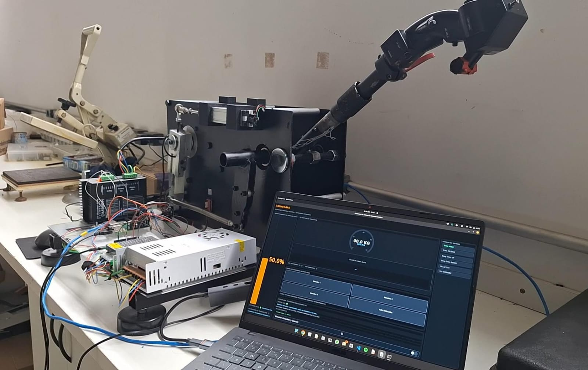

# Collective Pitch Control Prototype for Helicopter Simulation

<p align="center">
  
  
  
  
</p>

<p align="center">
  A functional prototype of an active collective-pitch control system for helicopter simulators, featuring force feedback, motion limits, trim functions, and automated actuation.
</p>

<p align="center">
  
</p>

---

## Overview

This project reproduces, at an experimental scale, the behavior of a real helicopter collective lever, including force feedback, movement limits, trim functions, and automated actuation. The system combines mechanical design, electronics, embedded control, and real-time communication to provide a realistic and modular platform for simulation applications.

The prototype was developed as part of the course "Projects in Computer Engineering" at the Federal University of São Paulo (ICT-UNIFESP), bringing together undergraduate, master's, and doctoral students to build a product prototype in an interdisciplinary engineering context.

## Hardware Platform

| Component | Specification |
|---|---|
| Servo motor | Policomp 86HS118-1560414-B35 |
| Digital stepper driver | DM860D |
| Power supply | 48V / 10A switched-mode |
| Controller | Arduino Leonardo |
| Embedded computer | Raspberry Pi 5 |
| Linear transducer | KTC1 — 100 mm |
| Force sensor module | HX711 + load cell |
| Limit sensors | 2x QRE1113 analog line sensors |
| End-stop indicators | 2x SMD LEDs with resistors |

## Software Architecture

The repository is divided into two main software domains:

### 1. Desktop Application

The Python layer implements the user-facing interface and communication with the hardware.

| File | Responsibility |
|---|---|
| `main.py` | Application entry point |
| `scca/dashboard.py` | Dashboard and control logic |
| `scca/styles.py` | Interface styling and visual theme |
| `scca/udp_receiver.py` | UDP communication and mock hardware support |

Key responsibilities:

- monitoring the state of the prototype;
- displaying telemetry;
- sending control commands;
- handling user interaction;
- receiving data from the embedded system.

### 2. Embedded Controller

The C++ project runs on the Raspberry Pi and implements the local control loop, hardware I/O, and actuator behavior.

| File | Responsibility |
|---|---|
| `raspberry_pi/CMakeLists.txt` | CMake build configuration |
| `raspberry_pi/src/main.cpp` | Main embedded control implementation |

Key responsibilities:

- reading the load cell;
- checking end-stop sensors;
- controlling the stepper motor;
- managing trim and autopilot logic;
- applying calibration and motion limits;
- transmitting UDP telemetry and receiving control packets.

## Repository Structure

```text
.
├── README.md
├── main.py
├── requirements.txt
├── docs/
│   └── images/
├── raspberry_pi/
│   ├── CMakeLists.txt
│   ├── build/
│   ├── scripts/
│   └── src/
│       └── main.cpp
├── scca/
│   ├── __init__.py
│   ├── dashboard.py
│   ├── styles.py
│   └── udp_receiver.py
├── scripts/
│   ├── check-network.sh
│   ├── fix-pc-ethernet.sh
│   └── configure-static-ip.sh
└── .venv/
```

| Directory / File | Description |
|---|---|
| `main.py` | Runs the dashboard application |
| `scca/` | Python package for the simulator interface and communication layer |
| `raspberry_pi/` | Embedded software for the Raspberry Pi controller |
| `scripts/` | Network and maintenance utilities |
| `docs/` | Documentation resources and images |
| `raspberry_pi/build/` | Generated CMake build artifacts for the Pi project |

## Getting Started

### Prerequisites

- Python 3.10+
- Qt 6 / PySide6
- CMake and a C++ compiler for the Raspberry Pi controller
- Access to the Raspberry Pi hardware platform
- Linux environment for development and execution

### Python Environment

Create a virtual environment and install dependencies:

```bash
python -m venv .venv
source .venv/bin/activate
pip install -r requirements.txt
```

Run the dashboard:

```bash
python main.py
```

### Embedded Controller Build

Build the Raspberry Pi project:

```bash
cd raspberry_pi
cmake -S . -B build
cmake --build build
```

The resulting executable is generated in the `build` directory and is intended to run on the Raspberry Pi hardware.

## Communication and Control

The system relies on UDP communication between the desktop application and the embedded controller.

- **Dashboard → Raspberry Pi:** command packets and configuration data
- **Raspberry Pi → Dashboard:** telemetry, state, and operational status

This allows the control logic to be evaluated in real time and makes the system portable to different interfaces and testing setups.

## Operational Modes

The active collective control prototype includes several logical states and behaviors, such as:

- idle state
- manual movement
- trim release
- beep trim up/down
- motion limits and safeties
- autopilot execution
- simulated hydraulic failure conditions

These modes are implemented both in the embedded controller and reflected in the graphical dashboard for monitoring and debugging.